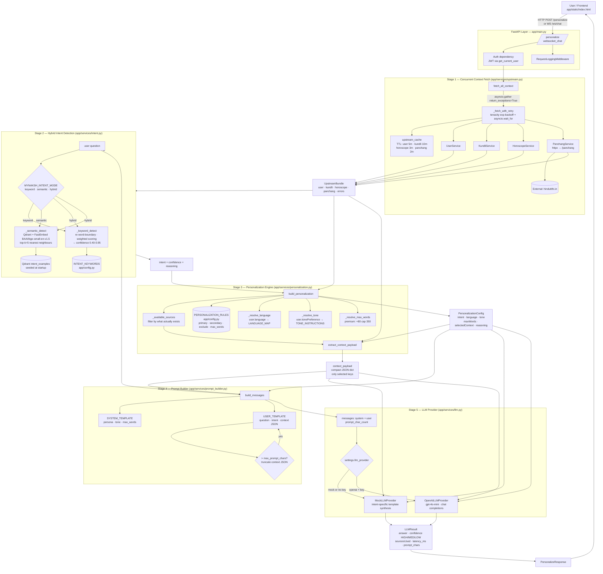

# Personalized AI Context Engine — Architecture Flow

This document describes the end-to-end flow used to **detect user intent** and **deliver the right context** to the LLM for generating a grounded response.

## High-level architecture

## Stage-by-stage breakdown

### 1. Request entry & auth — `app/main.py`
- `POST /personalize` and `WS /ws/chat` both authenticate via JWT (`get_current_user` / `get_current_user_ws`).
- `RequestLoggingMiddleware` attaches request-id and structured logs.

### 2. Concurrent upstream fetch — `app/services/upstream.py`
- `fetch_all_context(user_id)` runs **4 calls in parallel** with `asyncio.gather(return_exceptions=True)`:
  - `get_user` → profile (name, language, tonePreference, birthDetails)
  - `get_kundli` → lagna, moon sign, current dasha, houses (2/6/7/10)
  - `get_horoscope` → career/finance/health/relationship daily lines
  - `get_panchang` → today's tithi, nakshatra, yoga, karana
- Each call: TTL cache → `_fetch_with_retry` (tenacity exp-backoff + `asyncio.wait_for`).
- Partial failures are captured in `bundle.errors`; the pipeline continues.

### 3. Hybrid intent detection — `app/services/intent.py`
| Mode | Behaviour |
|------|-----------|
| `keyword` | Regex word-boundary scan over `INTENT_KEYWORDS`; weighted by phrase length; `general` fallback. |
| `semantic` | Embed the question (FastEmbed `BAAI/bge-small-en-v1.5`), Qdrant top-k nearest neighbours over `INTENT_EXAMPLES`, weighted vote. |
| `hybrid` (default) | Run both. If semantic confidence ≥ `semantic_min_confidence` (0.55), use semantic (boost when both agree, override when keywords are weak or semantic is clearly stronger). |

Output → `(intent, confidence, reasoning)` where intent ∈ `career | relationship | health | finance | general`.

### 4. Config-driven personalization — `app/services/personalization.py`
- Loads `PERSONALIZATION_RULES[intent]` from `app/config.py` (e.g. career → primary `10th House, Career Horoscope, Current Dasha`, exclude `Relationship Horoscope, 7th House`).
- `_available_sources(bundle)` filters rules by data that actually came back upstream.
- Resolves `language` (`LANGUAGE_MAP`), `tone` (`TONE_INSTRUCTIONS`), `max_words` (premium users get +80 up to `premium_max_words=350`).
- `extract_context_payload` materialises only the selected keys into a compact dict (e.g. `house_10`, `careerHoroscope`, `panchang`).

### 5. Prompt construction — `app/services/prompt_builder.py`
- `SYSTEM_TEMPLATE` injects persona + tone instruction + max-words cap.
- `USER_TEMPLATE` carries `question`, `intent`, and the **JSON-serialised selected context only**.
- Hard cap `max_prompt_chars=4000` triggers aggressive JSON truncation if exceeded.

### 6. LLM generation — `app/services/llm.py`
- `get_llm_provider()` picks `OpenAILLMProvider` (when `OPENAI_API_KEY` is set) or the deterministic `MockLLMProvider` (which synthesises grounded answers from `context_payload`).
- Returns `LLMResult { answer, confidence, sourcesUsed, latency_ms, prompt_chars }` → wrapped in `PersonalizeResponse` and sent back to the client.

## Personalization rules (from `app/config.py`)

| Intent | Primary | Excludes |
|--------|---------|----------|
| career | 10th House · Career Horoscope · Current Dasha | Relationship Horoscope · 7th House |
| relationship | 7th House · Relationship Horoscope · Moon Sign | Career · Finance |
| health | 6th House · Health Horoscope · Moon Sign | Finance · Career |
| finance | 2nd House · Finance Horoscope · Current Dasha | Relationship · Health |
| general | All major sources | — |

## Failure / edge handling

- **Upstream timeout / error** → caught by tenacity + `asyncio.gather(return_exceptions=True)`; partial context still usable, rest is logged.
- **Empty context payload** → 503 from `/personalize`, `error` frame on `/ws/chat`.
- **Prompt overflow** → context JSON truncated; header preserved.
- **LLM error** → 502; WS sends `{type:"error"}` and keeps the connection alive.

## File map

| Concern | File |
|---------|------|
| HTTP/WS routes | `app/main.py` |
| Upstream fetch (parallel, retry, cache) | `app/services/upstream.py` |
| Intent detection | `app/services/intent.py`, `app/services/semantic_intent.py` |
| Personalization rules + intent keys + tone map | `app/config.py` |
| Source selection & payload materialisation | `app/services/personalization.py` |
| Prompt assembly | `app/services/prompt_builder.py` |
| LLM adapters | `app/services/llm.py` |
| Pydantic schemas | `app/models/schemas.py` |